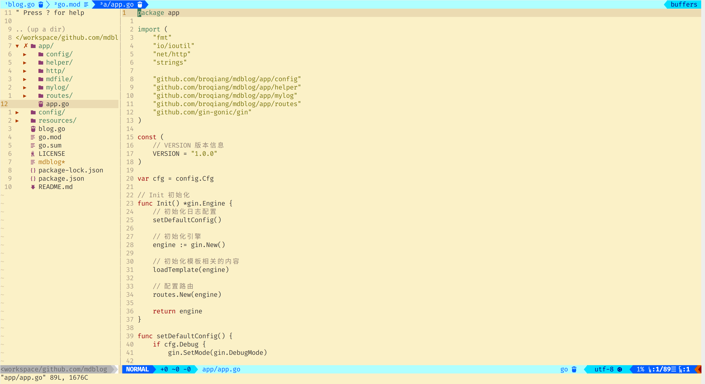

# vim 开发环境配置

因为特殊原因，一年多没有摸到电脑了，准备写代码了，先配置下环境

基于 Ubuntu 20.04 ， 其他发行版本未做测试，下面是配置完成后的效果



## 配置插件管理器

[vim-plug](https://github.com/junegunn/vim-plug)

```bash
curl -fLo ~/.vim/autoload/plug.vim --create-dirs \
    https://raw.githubusercontent.com/junegunn/vim-plug/master/plug.vim
```

编辑 `vim ~/.vimrc` ， 写入下面内容

```bash
" 插件开始的位置
call plug#begin('~/.vim/plug')

" 此处放准备安装的插件

" 插件结束的位置，插件全部放在此行上面
call plug#end()
```

配置完成后将 `.vimrc` 文件保存，再次打开， 然后输入 `:PlugInstall`，即可安装

PS: 安装时候看一下结果， 因为包都是从 github 上下载的， 因为网络原因不一定成功。

## 用到的插件

安装插件的时候，按照这个格式放在上面的 begin 和 end 之间即可， 如：

```bash
Plug 'morhetz/gruvbox'
```

+ [morhetz/gruvbox 主题配色](https://github.com/morhetz/gruvbox)

    更多主题可以参考 [这里](https://zhuanlan.zhihu.com/p/58188561)

+ [vim-airline vim 窗口状态栏](https://github.com/vim-airline/vim-airline)

+ [vim-airline-themes 状态栏的主题](https://github.com/vim-airline/vim-airline-themes)

+ [preservim/nerdtree vim 中文件系统浏览器](https://github.com/preservim/nerdtree)

+ [Xuyuanp/nerdtree-git-plugin 在 NERDTree 中显示 git 状态](https://github.com/Xuyuanp/nerdtree-git-plugin)

+ [ryanoasis/vim-devicons 显示图标，包括导航栏和状态栏](https://github.com/ryanoasis/vim-devicons)

+ [airblade/vim-gitgutter 文档中显示 git 信息](https://github.com/airblade/vim-gitgutter)

+ [iamcco/markdown-preview.nvim markdown 文档预览](https://github.com/iamcco/markdown-preview.nvim)

+ [SirVer/ultisnips](https://github.com/SirVer/ultisnips) 和
    [honza/vim-snippets](https://honza/vim-snippets) 两个插件配合， 生成代码片段

+ [coc.nvim 代码自动完成](https://github.com/neoclide/coc.nvim)

插件中需要配置的地方见 `vimrc` 文件，里面写了详细的注释

## coc.nvim 配置

详细的文档见 [https://github.com/neoclide/coc.nvim](https://github.com/neoclide/coc.nvim)

coc.nvim 需要 [nodejs](https://nodejs.org/en/download/) 支持。

### 安装 coc 的json 和 lsp 支持

```bash
:CocInstall coc-json coc-tsserver
```

### coc-snippets 代码片段支持

如果使用了这个插件， 上面的 SirVer/ultisnips 不再使用

详细的配置见 vimrc 文件的 coc.nvim 插件配置部分

#### 配置 coc Language servers

+ go 语言支持

    1. 需要提前配置好 go 环境，见 [https://golang.google.cn/](https://golang.google.cn/) 和 [https://goproxy.cn/](https://goproxy.cn/)

    1. 安装 gopls ， 终端中执行：

    ```bash
    go get golang.org/x/tools/gopls@latest
    ```

    1. 安装 coc-go ， 在 vim 中运行：
```bash
:CocInstall coc-go
```

+ shell 支持，在 vim 中运行：

```bash
:CocInstall coc-sh
```

+ 更多语言的支持见 [官方文档](https://github.com/neoclide/coc.nvim/wiki/Language-servers) ， 可以根据需要安装

## vimrc 详细的配置

```bash
" 基于 Ubuntu 20.04 的配置， 其他发行版本未做测试

"==============================================================================
" 处理 Gnome 终端不能使用 alt 快捷键， 不做这个处理无法在 vim 中映射 alt的快捷键
"==============================================================================
let c='a'
while c <= 'z'
    exec "set <A-".c.">=\e".c
    exec "imap \e".c." <A-".c.">"
    let c = nr2char(1+char2nr(c))
endw

set timeout ttimeoutlen=50
"==============================================================================

" ======================== 一些初始配置 ===========================
" 关闭兼容模式, 如果需要使用原始的 vi 模式， 配置： set compatible
" 默认就是关闭的， 如果不关，就无法使用 vim 的高级功能，包括下面的配置
set nocompatible

" 打开文件类型检测
filetype plugin indent on

" 定义快捷键的前缀，即<Leader> ， 默认是 \ ， 按的时候不太方便
let mapleader=";"

" 记住上次文件打开位置
if has("autocmd")
  au BufReadPost * if line("'\"") > 1 && line("'\"") <= line("$") | exe "normal! g'\"" | endif
endif

" 行列相关配置
set number " 显示绝对行号
set relativenumber " 显示相对行号， 会覆盖上面选项
" 设置切换绝对行号和相对行号的快捷键， 这个需要的时候切换提高效率
" 这里默认是相对行号， 需要绝对行号时候可以通过快捷键修改
nmap <Leader>nn :set relativenumber<CR>
nmap <Leader>nu :set norelativenumber<CR>
set cursorline " 突出显示当前所在行
" set cursorcolumn " 突出显示当前列


" 设置Tab长度为4空格， 只是显示， 真实的还是一个 tab
set tabstop=4

" 设置输入的 tab 转换成 4 个空格，这里只允许指定文件启用这个设置
au BufRead,BufNewFile *.md call SetTabToSpace()
function SetTabToSpace()
    set shiftwidth=4  " 转换 4 个空格
    set expandtab     " 实时生效，配合 shiftwidth
    set softtabstop=4 " 删除时候的行为， 也会同时删除 4 个空格
endfunction

" 继承前一行的缩进方式
set autoindent

" 开启实时搜索，随着你输入查询字串，显示不同的搜索结果
set incsearch
" 搜索时大小写不敏感
set ignorecase

" 退出插入模式指定类型的文件自动保存
au InsertLeave *.go,*.md write

" 全选当前文档
nmap <leader>a ggvG$

" 系统剪切板复制粘贴， vim 使用系统剪切板需要 vim 支持
" 查询可以通过 vim --version | grep clipboard 查看
" 如果显示 +clipboard 就是支持， 如果是 -clipboard 就是不支持
" ubuntu 可以直接安装 gui 包提供支持: sudo apt install vim-gtk
" normal 模式下复制到系统剪切板， 这里没有 "+yy 这样只能复制一行
" 使用的时候可以 alt + c ， 然后再输入 yy ， 就是一行
" 也可以在文件顶部， alt + c ， 然后再输入 yG ， 就是全部内容
" 粘贴可以 alt + c ，然后输入 p， 就是为了省略不太好按的 "+ 组合
nmap <M-c> "+
" 复制 v 模式的选中区域
vmap <M-c> "+y

" =================================================================

"==============================================================================
" 插件开始的位置
"==============================================================================

call plug#begin('~/.vim/plug')

set encoding=UTF-8

" 主题配色
Plug 'morhetz/gruvbox'

" 状态栏插件，包括显示行号，列号，文件类型，文件名，以及Git状态
Plug 'vim-airline/vim-airline'
" 状态栏目插件的主题，使用后可以使颜色看起来更加突出一点
Plug 'vim-airline/vim-airline-themes'

" 用来提供一个导航目录的侧边栏
Plug 'preservim/nerdtree'
" nerdtree 中显示 git 状态
Plug 'Xuyuanp/nerdtree-git-plugin'

" 可以在导航中显示图标， 不过需要有字体支持，否则就是乱码
" https://github.com/ryanoasis/nerd-fonts
" 终端也需要字体配合，如我使用的是 firacode nerd font Regular
" 喜欢其他字体也可以，不过要使用带 nerd font 的字体
Plug 'ryanoasis/vim-devicons'

" 可以在文档中显示 git 信息
Plug 'airblade/vim-gitgutter'

" markdown 预览
Plug 'iamcco/markdown-preview.nvim', { 'do': { -> mkdp#util#install() }, 'for': ['markdown', 'vim-plug']}
" markdown 中 latex 数学公式支持
" Plug 'iamcco/mathjax-support-for-mkdp'

" 下面两个插件要配合使用，可以自动生成代码块
" B
" Plug 'SirVer/ultisnips'   " 插件本身， 使用 coc-snippets 替换了
Plug 'honza/vim-snippets' " 代码片段仓库

" 代码自动完成插件
Plug 'neoclide/coc.nvim', {'branch': 'release'}

" 插件结束的位置，插件全部放在此行上面
call plug#end()
"==============================================================================


" ======================== 主题配色设置 ===========================
" 开启24bit的颜色，开启这个颜色会更漂亮一些
set termguicolors
" 主题配色
colorscheme gruvbox
" 主题背景 dark-深色; light-浅色
set background=light
" =================================================================


" ======================== nerdtree 插件配置 ======================
" 设置一个打开的快捷键， 如我的就是 " + b 打开， 再按一次关闭
nnoremap <leader>b :NERDTreeToggle<CR>
" 导航目录展开的符号
let g:NERDTreeDirArrowExpandable = '▸'
" 导航目录关闭的符号
let g:NERDTreeDirArrowCollapsible = '▾'
" 默认显示行号
let NERDTreeShowLineNumbers=1
" 打开文件时是否显示目录， 1- 显示 0- 不显示
let NERDTreeAutoCenter=1
" 是否显示隐藏文件
let NERDTreeShowHidden=1
" 设置宽度
" let NERDTreeWinSize=31
" 忽略一下文件的显示， 可以定义只隐藏指定文件或目录
let NERDTreeIgnore=['\.pyc','\~$','\.swp','\.git']
" =================================================================


" ======================== nerdtree-git-plugin 插件 ===============
" 是否显示忽略文件 1- 显示 0- 不显示 默认 0
" let g:NERDTreeGitStatusShowIgnored = 1
" =================================================================


" ======================== vim-airline 插件配置 ===================
" 状态栏目使用主题， 还可以使用 dark， simple， solarized light 等
" 更多主题 https://github.com/vim-airline/vim-airline/wiki/Screenshots
let g:airline_theme='light'
" 安装字体后，启用这个选项后在状态栏可以看到图标
" 需要先安装 powerline 字体才可以 sudo apt-get install fonts-powerline
" 如果没有安装 powerline 字体不要启用这个选项，否则会显示乱码
" 如果 vim-devicons 插件配置好了就可以忽略 powerline 字体，这个插件包含
" 了字体图标，并且更加漂亮
let g:airline_powerline_fonts = 1

" 启动顶部的 tabline ， 可以显示打开的 buffers， 显示多 tab 标签
let g:airline#extensions#tabline#enabled = 1

" 设置切换 tab 标签（buffer）的快捷键
let g:airline#extensions#tabline#buffer_idx_mode = 1
 nmap <leader>1 <Plug>AirlineSelectTab1
 nmap <leader>2 <Plug>AirlineSelectTab2
 nmap <leader>3 <Plug>AirlineSelectTab3
 nmap <leader>4 <Plug>AirlineSelectTab4
 nmap <leader>5 <Plug>AirlineSelectTab5
 nmap <leader>6 <Plug>AirlineSelectTab6
 nmap <leader>7 <Plug>AirlineSelectTab7
 nmap <leader>8 <Plug>AirlineSelectTab8
 nmap <leader>9 <Plug>AirlineSelectTab9
 nmap <leader>0 <Plug>AirlineSelectTab0
 nmap <leader>h <Plug>AirlineSelectPrevTab
 nmap <leader>l <Plug>AirlineSelectNextTab
" =================================================================


" ======================== markdwon 插件配置 ======================
" 更多的配置见 https://github.com/iamcco/markdown-preview.nvim
" vim 打开markdown 文档是否自动预览， 0 - 否， 1 - 是， 默认： 0
" let g:mkdp_auto_start = 1

" 关闭 markdown 是否自动关闭预览文件， 0 - 否， 1 - 是， 默认： 1
" let g:mkdp_auto_close = 1

" 在启动 markdown 预览时是否在终端回显 url
" 如显示： Preview page: http://127.0.0.1:8472/page/1
let g:mkdp_echo_preview_url = 1

" markdwon 的快捷键
map <silent> <F5> <Plug>MarkdownPreview
map <silent> <F6> <Plug>StopMarkdownPreview
" =================================================================


" ======================== coc.nvim 插件配置 ======================
" 详细见 https://github.com/neoclide/coc.nvim#example-vim-configuration
" 不清楚作用，推荐配置里面有，详细见 https://github.com/neoclide/coc.nvim/issues/649
set nobackup
set nowritebackup

" 更改更新时间， 默认是 4000 ms
set updatetime=300

" 为消息留出更多的空间
set cmdheight=2


" 追踪到定义的位置
nmap <silent> gd <Plug>(coc-definition)
nmap <silent> gy <Plug>(coc-type-definition)
nmap <silent> gi <Plug>(coc-implementation)
" 查看被谁引用
nmap <silent> gr <Plug>(coc-references)

" 预览窗口显示文档
nnoremap <silent> K :call <SID>show_documentation()<CR>
function! s:show_documentation()
  if (index(['vim','help'], &filetype) >= 0)
    execute 'h '.expand('<cword>')
  elseif (coc#rpc#ready())
    call CocActionAsync('doHover')
  else
    execute '!' . &keywordprg . " " . expand('<cword>')
  endif
endfunction

autocmd CursorHold * silent call CocActionAsync('highlight')

" 重命名的快捷操作
nmap <leader>rn <Plug>(coc-rename)

" 关闭提示后手动唤醒提示
inoremap <silent><expr> <c-l> coc#refresh()
" 通过回车展开代码片段
inoremap <silent><expr> <cr> pumvisible() ? coc#_select_confirm()
                              \: "\<C-g>u\<CR>\<c-r>=coc#on_enter()\<CR>"

" 可以通过 tab 键来切换提示列表选择
inoremap <silent><expr> <TAB>
      \ pumvisible() ? "\<C-n>" :
      \ <SID>check_back_space() ? "\<TAB>" :
      \ coc#refresh()
inoremap <expr><S-TAB> pumvisible() ? "\<C-p>" : "\<C-h>"

function! s:check_back_space() abort
  let col = col('.') - 1
  return !col || getline('.')[col - 1]  =~# '\s'
endfunction

" 代码提示列表选择， 将原本的 c-p 和 c-n 添加更习惯的方式
inoremap <silent><expr> <M-k> "\<C-p>"
inoremap <silent><expr> <M-j> "\<C-n>"

" 格式化代码， 需要 lsp 支持
xmap <leader>f  <Plug>(coc-format-selected)
nmap <leader>f  <Plug>(coc-format-selected)

" 修复当前选中的代码
nmap <leader>qf  <Plug>(coc-fix-current)

" 显示错误信息
nmap <silent> <M-k> <Plug>(coc-diagnostic-prev)
nmap <silent> <M-j> <Plug>(coc-diagnostic-next)

" coc-go 的配置
" 在保存的时候自动导包
autocmd BufWritePre *.go :silent call CocAction('runCommand', 'editor.action.organizeImport')
" =================================================================
```

这个文档未来不一定会及时更新，可以查看仓库中的 [vimrc 文件](./vimrc)

## 报错处理

### `[coc.nvim] build/index.js not found`

报这个错误

```bash
[coc.nvim] build/index.js not found, please install dependencies and compile coc.nvim by: yarn install
```

本机有 node 和 yarn 环境，但是还是出现这个错误，原因没去研究，手动安装下 coc.nvim 依赖可以解决

```bash
# 如果没有 yarn 环境可以安装，有的话就跳过
sudo apt install nodejs
sudo npm install -g yarn

# 下面是手动解决依赖
cd ~/.vim/plugged/coc.nvim/
yarn install
yarn build
```
